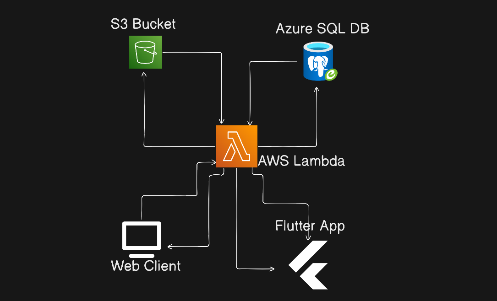

<div align="center">
    
  <h1>myBucket</h1>
  <p><strong>Low-cost cloud storage solution using AWS S3, AWS Lambda and Azure SQL DB</strong></p>

  [](#)
  [](#)
  [](#)
  [](#)
  [](#)
</div>

An application using S3 bucket, AWS Lambda, and an Azure DB cloud drive working with low-cost **pre-signed URL generation strategies**. It supports both a Flutter mobile application and a sleek Web application hosted on Vercel.

---

# Table of Content
- [Features](#features)
- [Architecture & Working](#architecture--working)
- [Setup Guide (For Personal Projects)](#setup-guide-for-personal-projects)
  1. [S3 Bucket Setup & Permissions](#1-s3-bucket-setup--permissions)
  2. [Azure SQL Database Setup](#2-azure-sql-database-setup)
  3. [AWS Lambda & API Gateway Setup](#3-aws-lambda--api-gateway-setup)
  4. [GitHub CI/CD Pipeline](#4-github-cicd-pipeline)
- [Building & Running the Application](#building--running-the-application)
  1. [Flutter Mobile App](#flutter-mobile-app)
  2. [Web Application (Vercel)](#web-application-vercel)

# Features
- **Direct-to-S3 Uploads**: Prevents AWS Lambda timeouts and bandwidth limits by uploading directly from the client.
- **Image Compression**: Client-side conversion to `.webp` formats before uploading to save storage.
- **Cross-Platform**: Full Flutter Mobile App & matching Web Application (HTML/JS/CSS).
- **Automated CI/CD**: Fully automated Lambda deployment via GitHub Actions.
- **Gallery View**: Organized visual gallery of all uploaded items with instant previews.

# Architecture & Working
The application bypasses heavy server loads by generating temporary presigned URLs via AWS Lambda. The heavy lifting (uploading binary files) is done directly between the client (Browser/Phone) and the S3 Bucket.
<div align="center">

</div>

---

# Setup Guide (For Personal Projects)

## 1. S3 Bucket Setup & Permissions
1. Create a new AWS S3 Bucket.
2. Uncheck **Block all public access** if you want your gallery previews to be publicly accessible, OR rely purely on GET presigned URLs.
3. **Crucial Step (CORS)**: Navigate to your Bucket > Permissions > **Cross-origin resource sharing (CORS)** and paste this:
   ```json
   [
       {
           "AllowedHeaders": ["*"],
           "AllowedMethods": ["GET", "PUT", "POST", "HEAD"],
           "AllowedOrigins": ["*"],
           "ExposeHeaders": []
       }
   ]
   ```
   *(For production, replace `"*"` in AllowedOrigins with your specific Web App URL).*

## 2. Azure SQL Database Setup
1. Create a Free/Basic Azure SQL Database.
2. **Firewall Settings**: Go to the server firewall settings and **Allow all Azure services and resources to access this server**, OR explicitly whitelist your AWS Lambda IP/VPC.
3. Run the following SQL script to create the required table:
   ```sql
   CREATE TABLE Files (
       Id INT IDENTITY(1,1) PRIMARY KEY,
       FileName NVARCHAR(255),
       FolderPath NVARCHAR(255),
       S3Url NVARCHAR(1000),
       ContentType NVARCHAR(100),
       UploadedAt DATETIME DEFAULT GETDATE()
   );
   ```

## 3. AWS Lambda & API Gateway Setup
1. Create a new Python 3.10 Lambda Function (`s3-upload-lambda`).
2. Attach an execution role that has **AmazonS3FullAccess** (or specific PutObject/GetObject permissions for your bucket).
3. **Environment Variables**: Set the following variables in your Lambda configuration:
   - `AWS_REGION_VAL`: Your AWS region (e.g., `ap-south-1`)
   - `S3_BUCKET_NAME`: Name of your bucket
   - `DB_SERVER`: Your Azure DB server (e.g., `xxx.database.windows.net`)
   - `DB_USER`: Database username
   - `DB_PASSWORD`: Database password
   - `DB_NAME`: Database name
4. **API Gateway**: Attach an API Gateway trigger. 
   - **Important**: Enable CORS in API Gateway for `OPTIONS`, `GET`, `POST`, and `DELETE` methods. Make sure to **Deploy the API** after configuring CORS!

---

## 4. GitHub CI/CD Pipeline
This repository includes a GitHub Actions pipeline [`.github/workflows/lambda-deploy.yml`](.github/workflows/lambda-deploy.yml) that automatically zips and deploys your Python code to AWS Lambda whenever you push to the `main` branch.

### Required GitHub Secrets
Go to your GitHub Repository -> **Settings** -> **Secrets and variables** -> **Actions** and add:
- `AWS_ACCESS_KEY_ID`: Your IAM user access key.
- `AWS_SECRET_ACCESS_KEY`: Your IAM user secret key.
- `AWS_REGION`: The region where your Lambda lives (e.g., `ap-south-1`).

<br>

---

# Building & Running the Application
## Flutter Mobile App
1. Ensure you have the Flutter SDK installed.
2. Replace the [`lib/`](./lib/) folder & [`pubspec.yaml`](./pubspec.yaml) in the root directory with the ones in this repository.
2. In the root directory and fetch dependencies:
   ```bash
   flutter pub get
   ```
3. Run the app on an emulator or physical device:
   ```bash
   flutter run
   ```
4. On the first launch, tap the **Settings** icon and paste your AWS API Gateway URL.

## Web Application (Vercel)
The web version is located in the `website/` directory and mimics the mobile app using standard HTML/JS/CSS.
1. Create an account on [Vercel](https://vercel.com).
2. Click **Add New Project** and import this GitHub repository.
3. **Crucial**: Set the **Root Directory** to [`website/`](./website/).
4. Click **Deploy**.
5. Once deployed, open the site, click the **Settings** gear, and paste your AWS API Gateway URL. 

